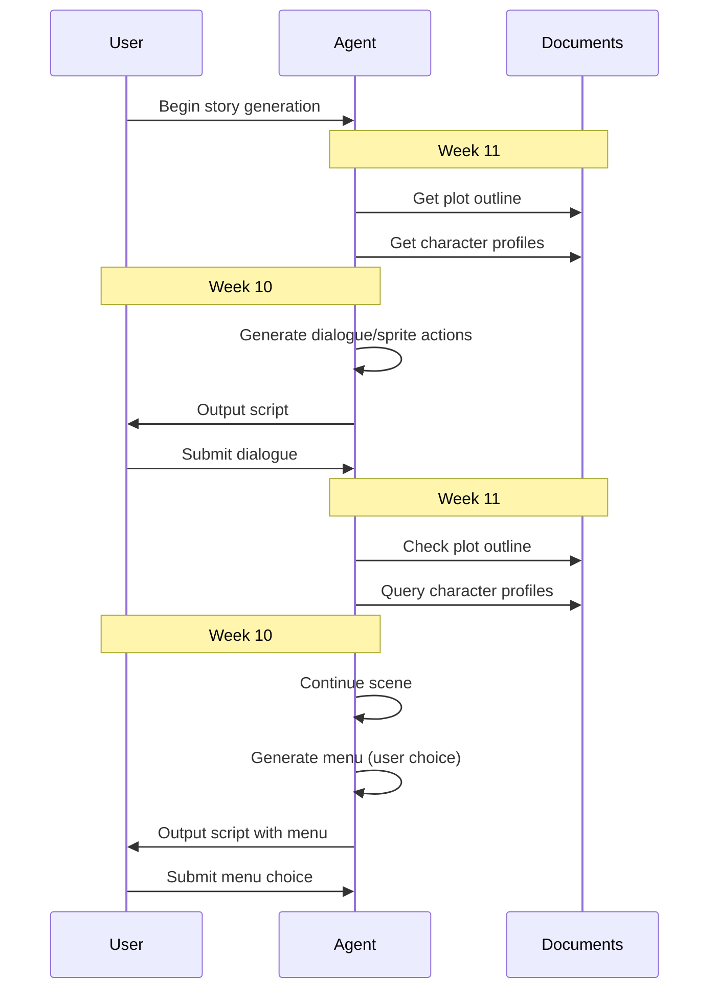

# Agentic RAG System Design

## Definitions:
- __Agent__: The LLM model that will generate the story content based on the provided documents and user input. Interfaces with documents/output script via tools.
- __Script__: A file with dialogue, sprite actions, and "menus" (multiple option choices for the user) that can be read by the visual novel engine (or printed to the console/output in Gradio) to run a scene. Outputted by the agent.
- __Documents__: A collection of markdown files that the agent can query for information. This includes character profiles, plot outlines, and any other relevant information for the story.
- __Plot outline__: A document that contains the overall plot of the story, including events, possible branches, and how the story should progress.
- __Character profiles__: Documents that contain information about each character, including their personality, background, visual description, and how they would react in certain situations.
- __Dialogue__: The lines that characters speak in the story.
- __Sprite actions__: Instructions for how character sprites should be displayed (e.g. "show", "move", "hide").
- __Menu__: A set of options presented to the user at a decision point in the story. (e.g. "Study for exam" vs. "Play video games)